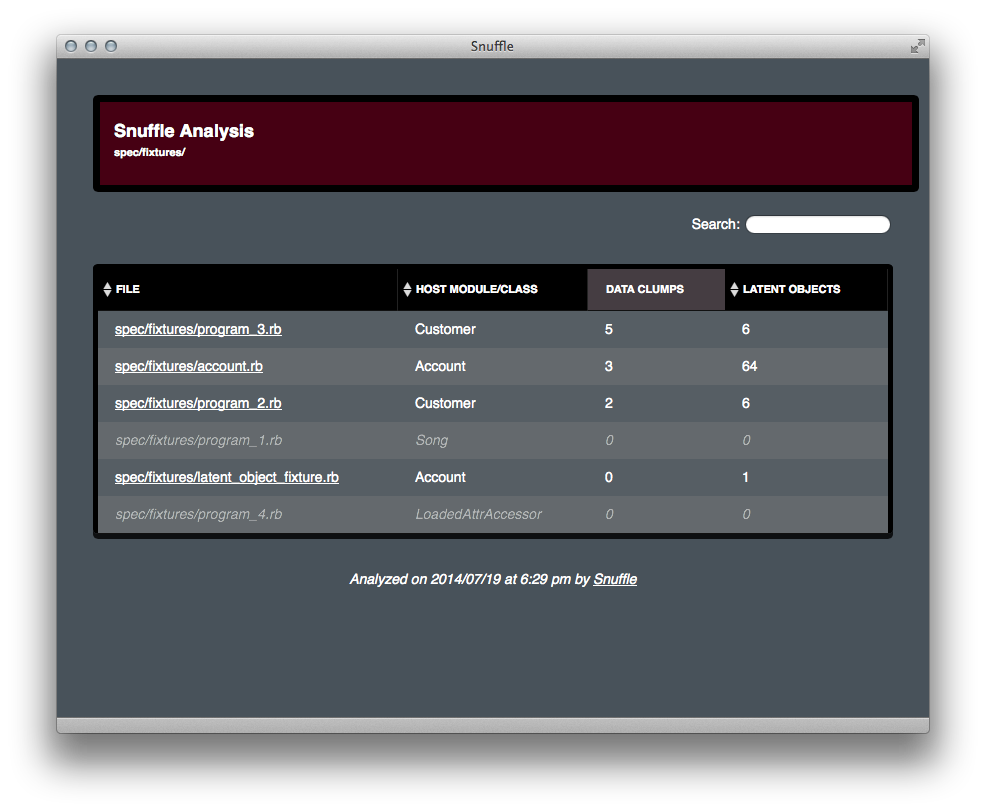
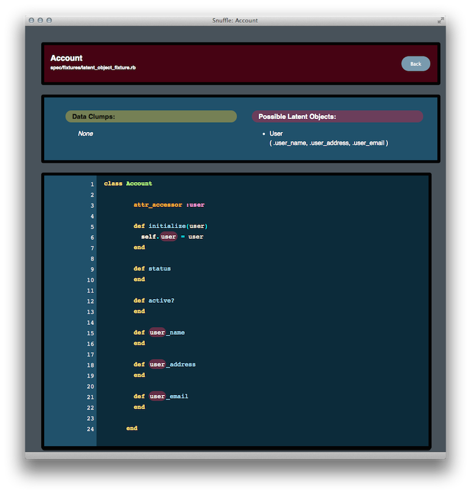

# Snuffle

Snuffle analyzes source code to identify "data clumps", clusters of attributes
that are often used together. It uses this analysis to propose objects that
may be extracted from a given class. It also looks for objects that are hinted
at by method names and identifies them as "latent objects". For example, if you
have `home_address` and `work_address` methods in a User class, Snuffle will
tell you that you might want to extract those methods to a latent Address class.

Please note that Snuffle is still pre-release and will not be ready for serious
use until it hits version 1.0.0.

## Installation

Add this line to your application's Gemfile:

    gem 'snuffle'

And then execute:

    $ bundle

Or install it yourself as:

    $ gem install snuffle

## Usage

    $ snuffle check lib/example.rb

    Checking lib/example.rb...
    Results written to doc/snuffle/index.htm

## Sample Output

## Contributing

Please note that this project is released with a [Contributor Code of Conduct](https://gitlab.com/coraline/snuffle/blob/master/CODE_OF_CONDUCT.md). By participating in this project you agree to abide by its terms.

1. Fork the project
2. Create your feature branch (`git checkout -b my-new-feature`)
3. Commit your changes (`git commit -am 'Add some feature'`)
4. Push to the branch (`git push origin my-new-feature`)
5. Create a new Merge Request
